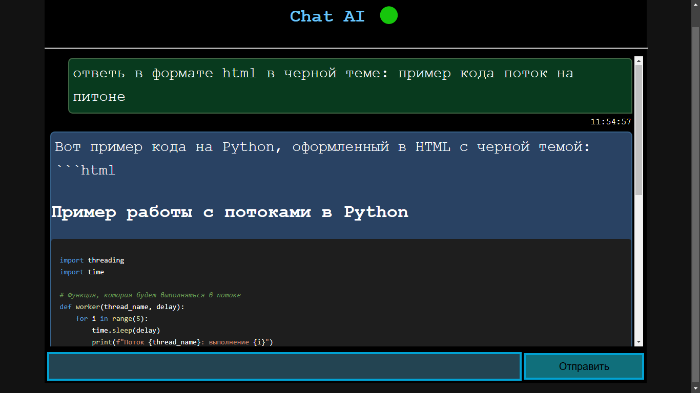

# ai_chat

Ai chat support more HTML-tags
in response (need write this rule to promt)

```bash
python app.py
# http://127.0.0.1:5000
```

or

```bash
python AiChatQt.py
# started pyqt window
```



---

for works local browser vwersion (app.py)
need append file `config.py`

```py
deepseek_api_base = 'https://api.deepseek.com/v1'
deepseek_api_key = 'api-key'
```
